# Evidencias de ejecucion

Fecha base de ejecucion reproducible: `2026-02-23`

## 1) NameNode UI (9870)

Capturas:

- C02 - NameNode Live Nodes  
  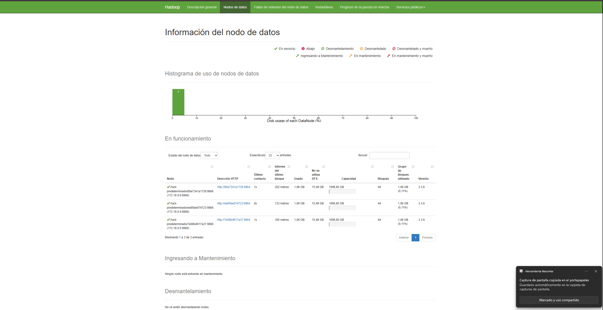
- C03 - Capacidad HDFS en UI  
  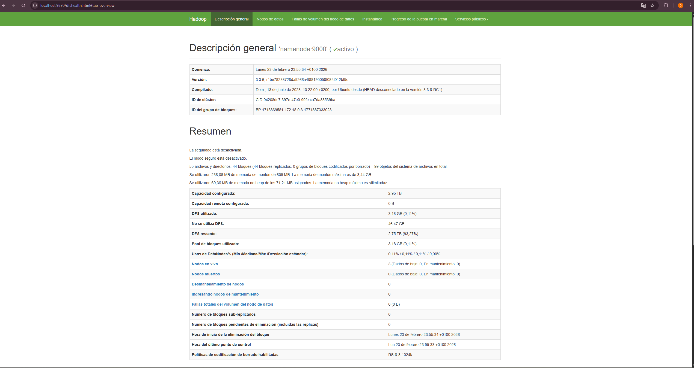

Comando equivalente usado:

```bash
docker exec namenode bash -lc "hdfs dfsadmin -report | sed -n '1,120p'"
```

## 2) Auditoria fsck

Capturas:

- C09 - Ejecucion auditoria fsck  
  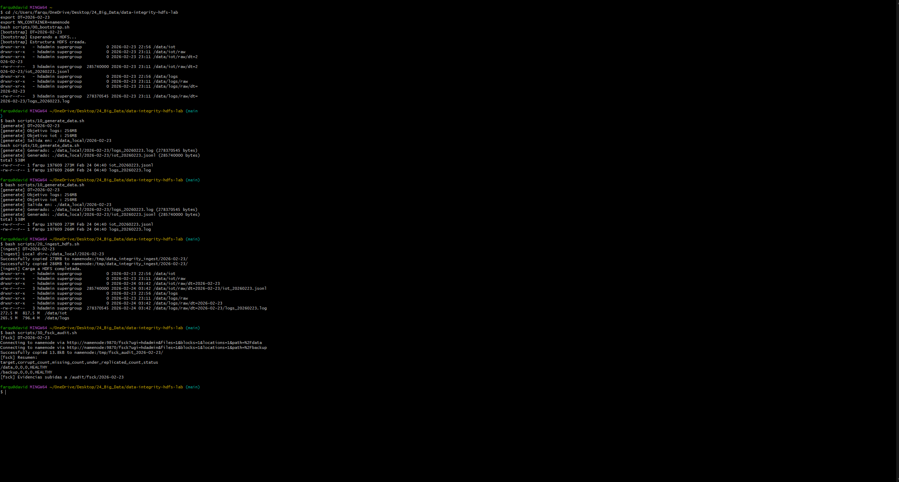
- C10 - fsck detallado (bloques/locations)  
  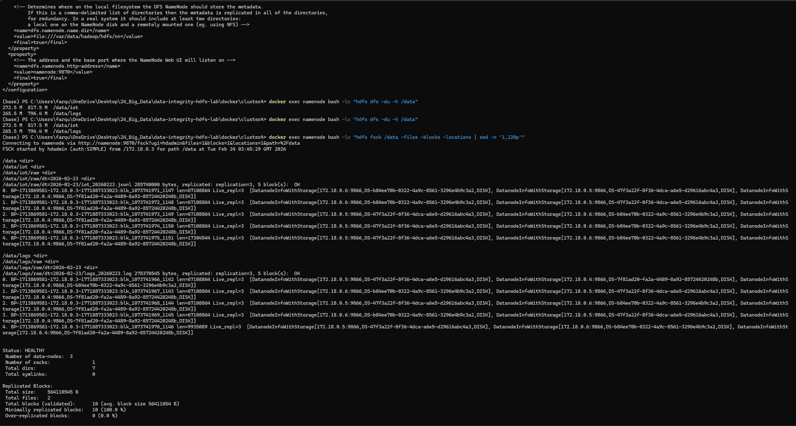
- C10.5 - fsck detallado adicional  
  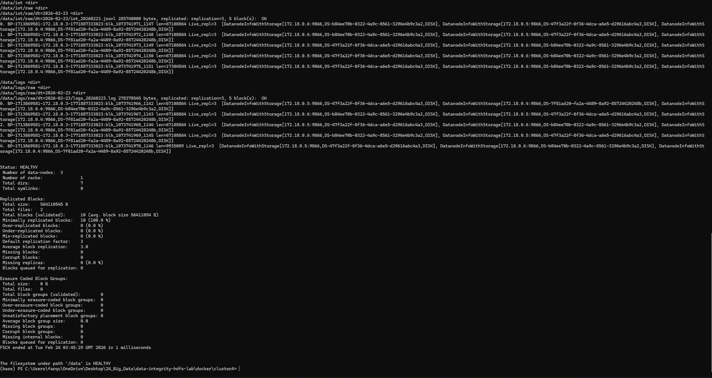
- C11 - Resumen fsck CSV  
  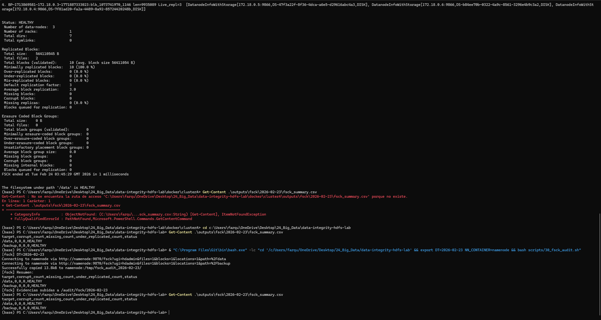

Resumen obtenido:

```csv
target,corrupt_count,missing_count,under_replicated_count,status
/data,0,0,0,HEALTHY
/backup,0,0,0,HEALTHY
```

Ficheros generados:

- `outputs/fsck/2026-02-23/fsck_data.txt`
- `outputs/fsck/2026-02-23/fsck_backup.txt`
- `outputs/fsck/2026-02-23/fsck_summary.csv`

Tambien subido a HDFS:

- `/audit/fsck/2026-02-23/`

## 3) Backup + validacion

Capturas:

- C12 - Backup copiado  
  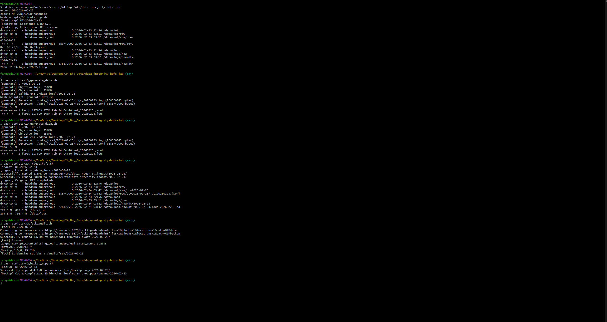
- C13 - Validacion inventario  
  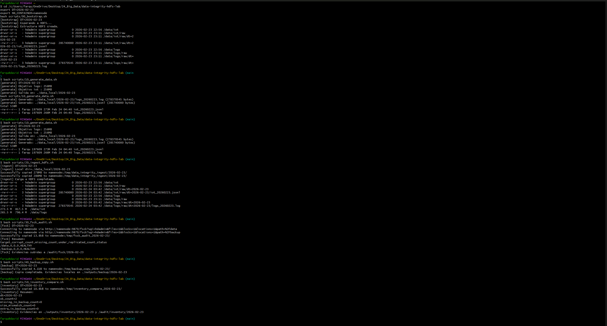
- C14 - Browse `/backup` en UI  
  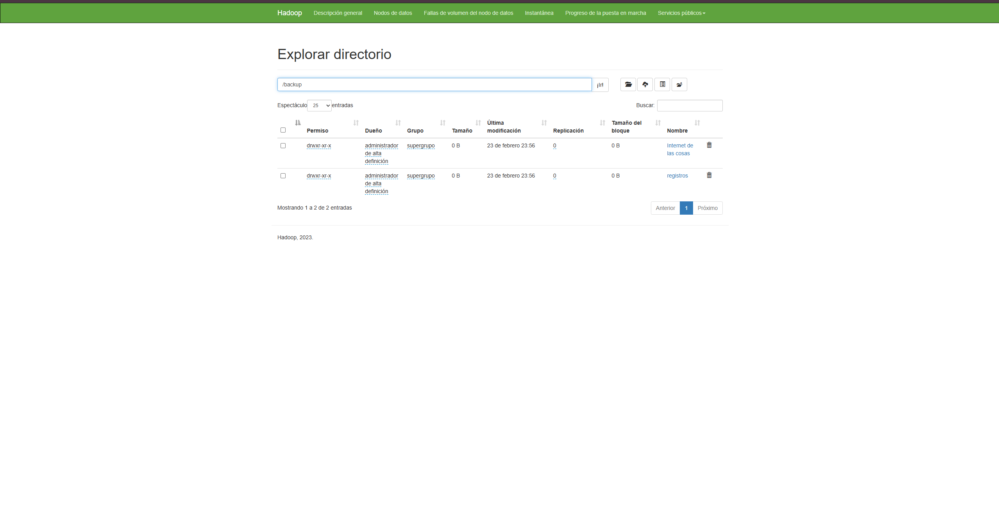

Resumen obtenido:

```text
dt=2026-02-23
ok_count=2
missing_in_backup_count=0
size_mismatch_count=0
extra_in_backup_count=0
```

Ficheros generados:

- `outputs/backup/2026-02-23/backup_ls.txt`
- `outputs/backup/2026-02-23/backup_du.txt`
- `outputs/inventory/2026-02-23/data_inventory.csv`
- `outputs/inventory/2026-02-23/backup_inventory.csv`
- `outputs/inventory/2026-02-23/inventory_compare.csv`
- `outputs/inventory/2026-02-23/inventory_summary.txt`

Tambien subido a HDFS:

- `/audit/inventory/2026-02-23/`

## 4) Incidente + recuperacion

Incidente ejecutado:

- `docker stop clustera-dnnm-3`

Capturas:

- C15 - Incidente simulado  
  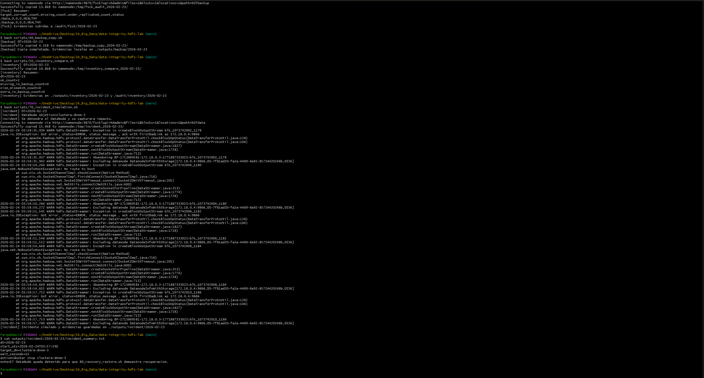
- C16 - Resumen del incidente  
  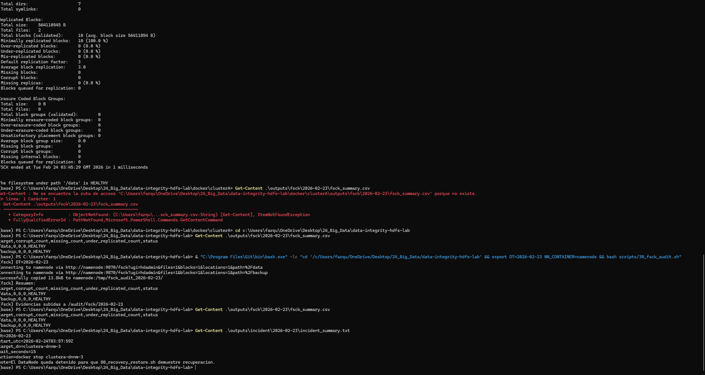
- C17 - Recuperacion  
  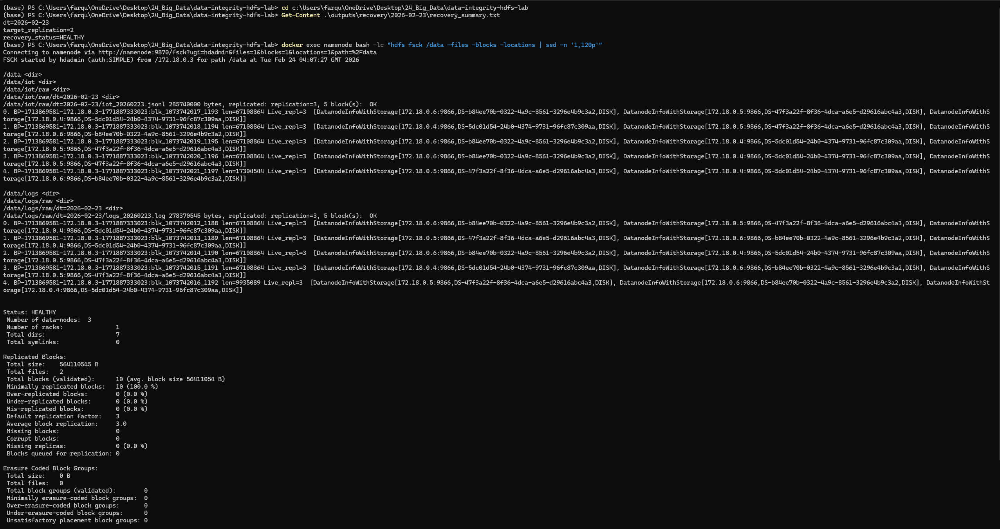

Resumen recuperacion:

```text
dt=2026-02-23
target_replication=2
recovery_status=HEALTHY
```

Ficheros generados:

- `outputs/incident/2026-02-23/before_report.txt`
- `outputs/incident/2026-02-23/during_report.txt`
- `outputs/incident/2026-02-23/during_fsck_data.txt`
- `outputs/incident/2026-02-23/incident_summary.txt`
- `outputs/recovery/2026-02-23/after_restart_report.txt`
- `outputs/recovery/2026-02-23/fsck_data_after_recovery.txt`
- `outputs/recovery/2026-02-23/recovery_summary.txt`

Tambien subido a HDFS:

- `/audit/incidents/2026-02-23/`

## 5) Metricas y coste

Capturas:

- C19 - `docker stats` en vivo durante operacion  
  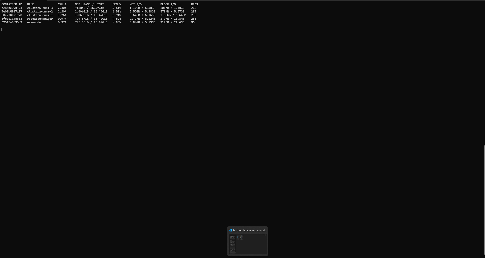

Tablas:

```csv
step,duration_seconds
00_bootstrap.sh,10
10_generate_data.sh,15
20_ingest_hdfs.sh,46
30_fsck_audit.sh,8
40_backup_copy.sh,13
50_inventory_compare.sh,6
70_incident_simulation.sh,62
80_recovery_restore.sh,31
```

```csv
replication,duration_seconds
1,21.28
2,11.29
3,21.23
```

Ficheros generados:

- `outputs/metrics/2026-02-23/step_times.csv`
- `outputs/metrics/2026-02-23/replication_experiment.csv`
- `outputs/metrics/2026-02-23/docker_stats_snapshot.txt`
- `outputs/metrics/2026-02-23/docker_stats_rep1.txt`
- `outputs/metrics/2026-02-23/docker_stats_rep2.txt`
- `outputs/metrics/2026-02-23/docker_stats_rep3.txt`

## 6) Galeria completa (orden cronologico)

- C01 - Cluster levantado  
  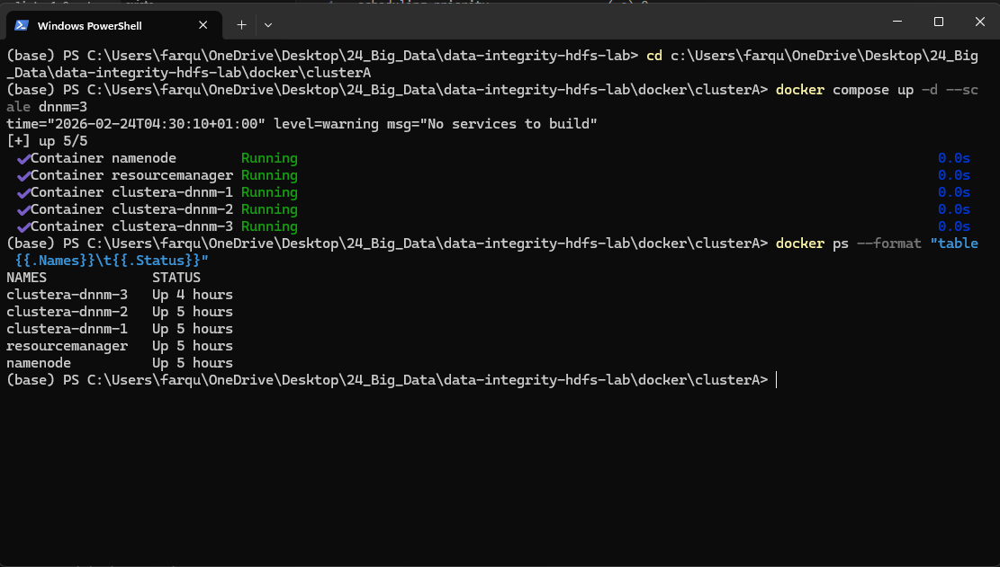
- C02 - NameNode Live Nodes  
  
- C03 - Capacidad HDFS  
  
- C04 - Parametros HDFS (R2)  
  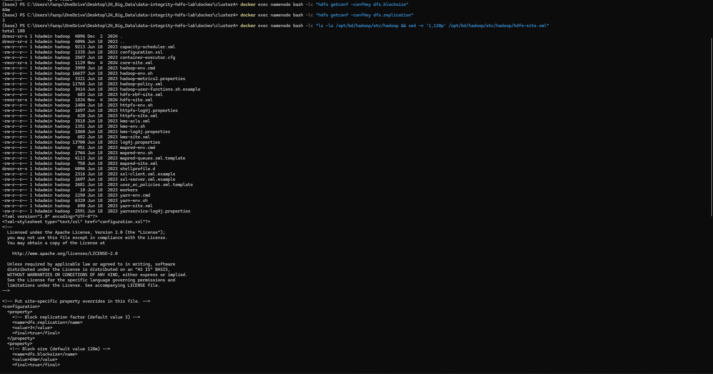
- C04.5 - Parametros HDFS (detalle)  
  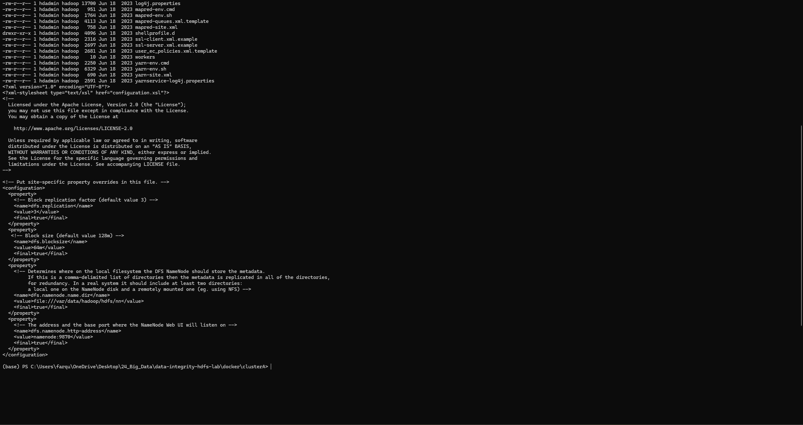
- C05 - Bootstrap (estructura HDFS)  
  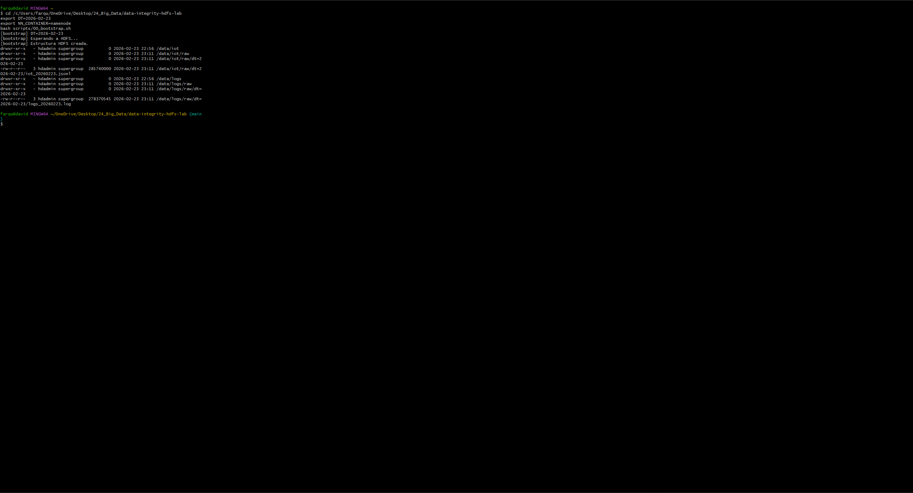
- C06 - Generacion de dataset  
  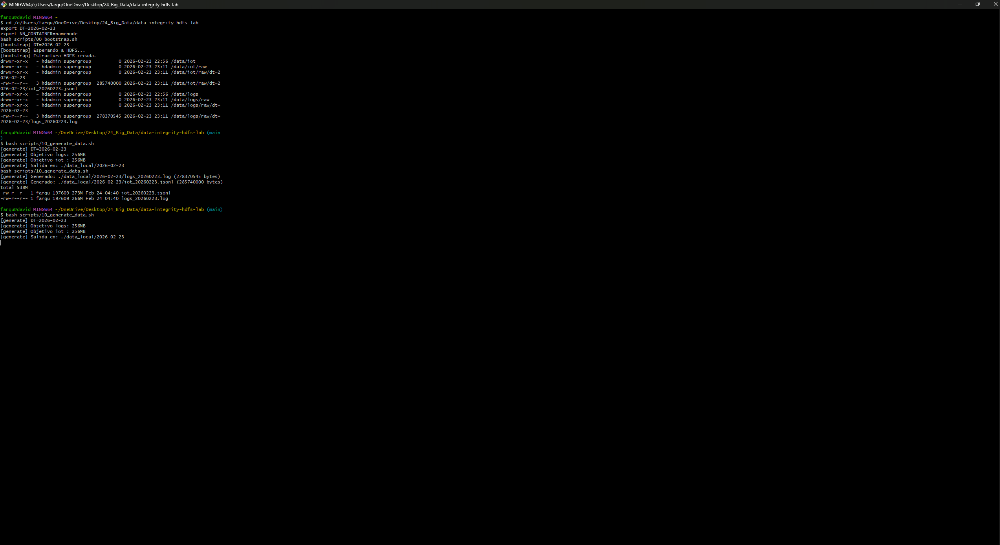
- C07 - Ingesta HDFS (`ls -R`)  
  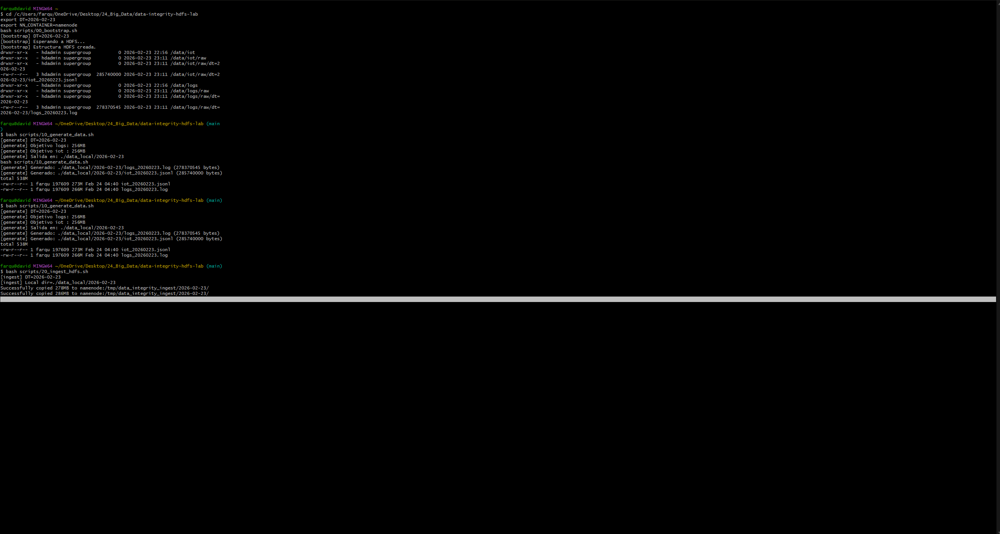
- C08 - Ingesta HDFS (`du -h`)  
  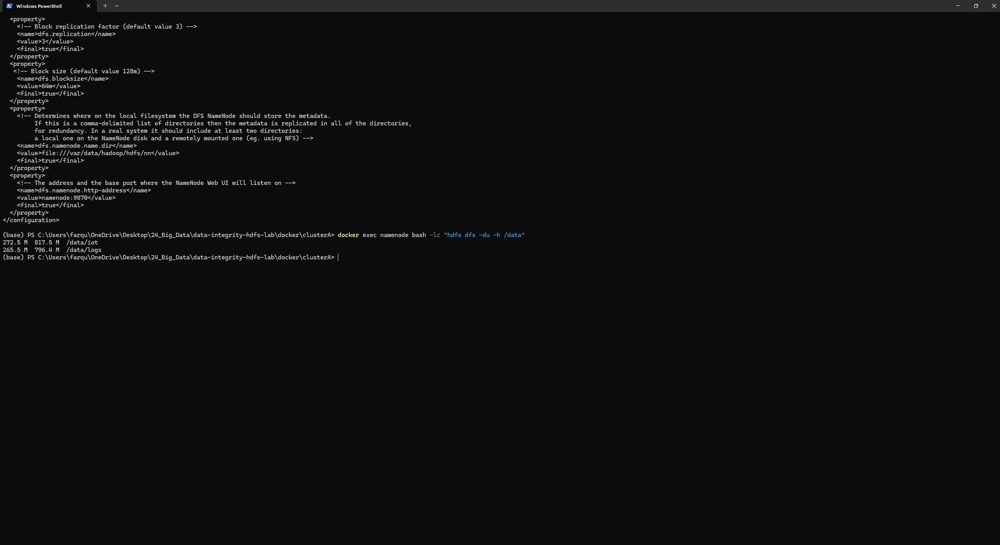
- C09 - Auditoria fsck  
  
- C10 - fsck detallado  
  
- C10.5 - fsck detallado adicional  
  
- C11 - Resumen fsck CSV  
  
- C12 - Backup copiado  
  
- C13 - Validacion inventario  
  
- C14 - Browse backup UI  
  
- C15 - Incidente simulado  
  
- C16 - Evidencia incidente (report)  
  
- C17 - Recuperacion  
  
- C19 - Metricas docker stats  
  

Capturas adicionales:

- Extra 01  
  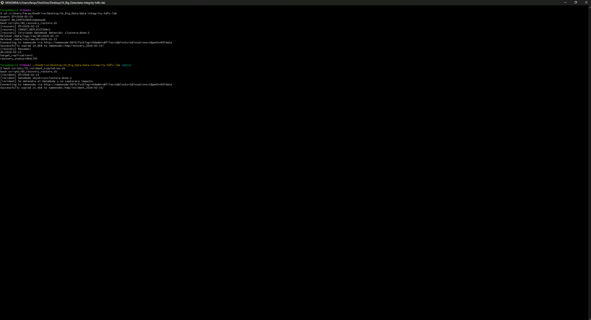
- Extra 02  
  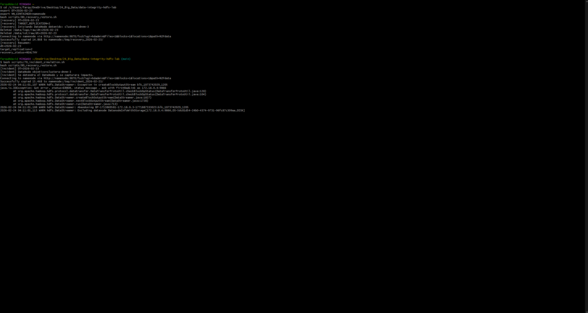
- Extra 03  
  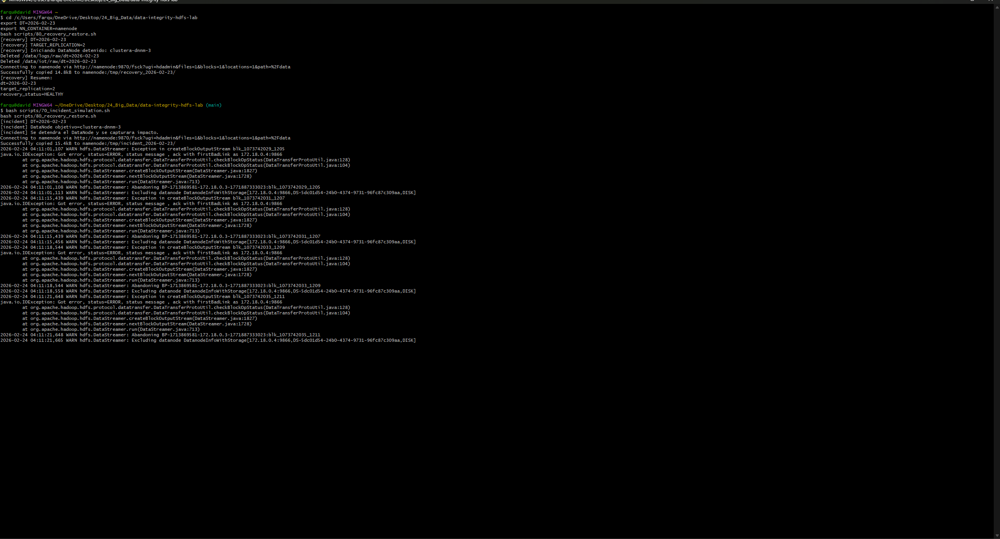
